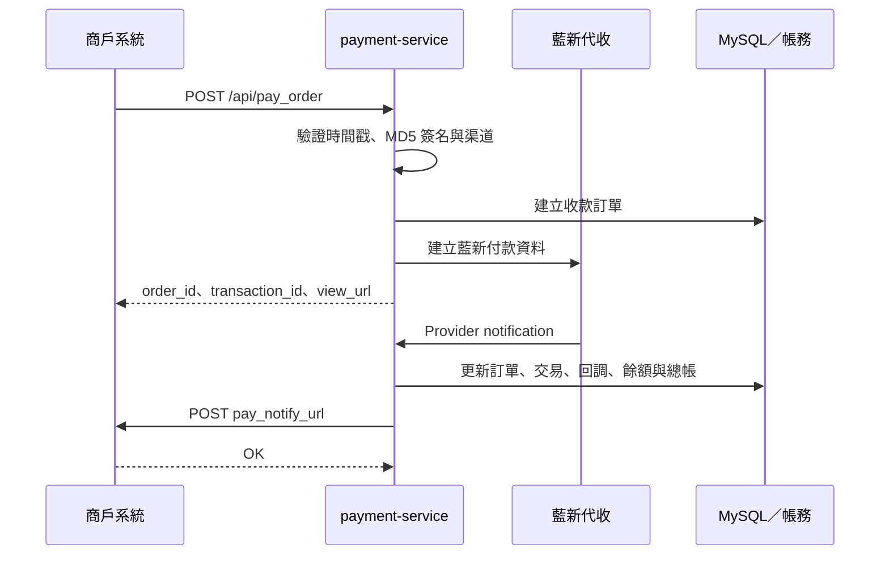
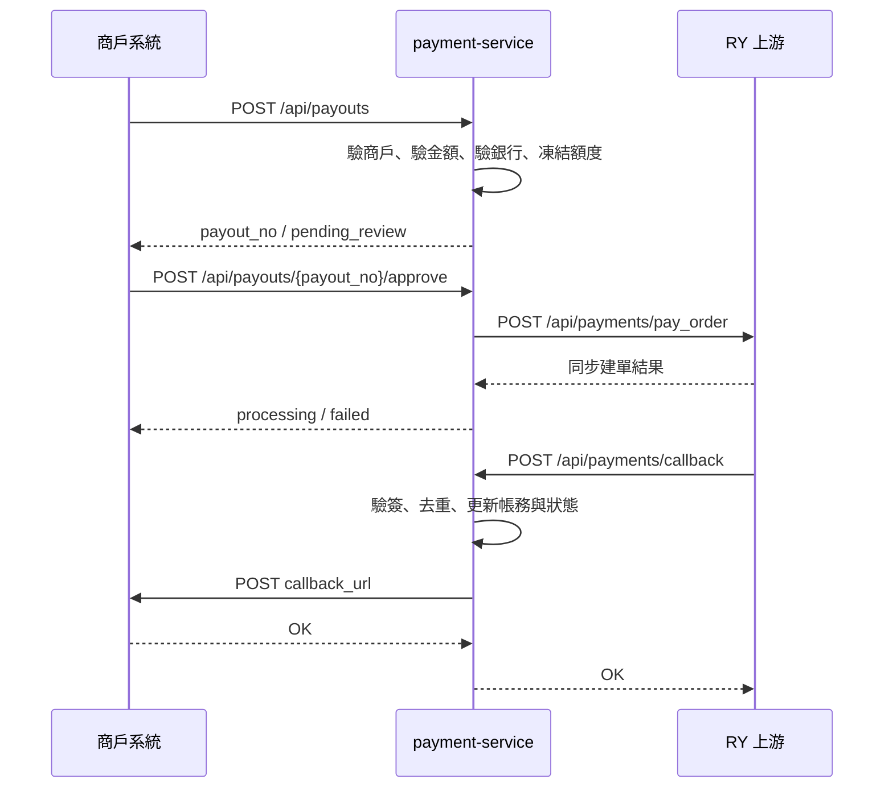
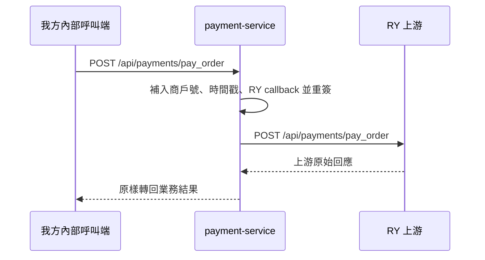

# 對外 API 流程與端點說明

> 文件定位：目前程式實際註冊的 HTTP 路由總覽。欄位細節請分別閱讀 [02_RY收款串接規格](./02_RY收款串接規格.md)與 [03_RY代付串接規格](./03_RY代付串接規格.md)。
>
> 最後對齊：2026-07-07

## 先分清楚兩種代付 API

### 1. `/api/payments/*`

這組是 **RY provider contract 代理層**。  
適合做上游直連、除錯、驗證 RY 原始行為。

### 2. `/api/payouts/*`

這組是 **我方正式提款工作流 API**。  
商戶若要走完整提款流程，應優先串這組。

## 正式對外端點

| 方法 | 路徑 | 用途 |
|---|---|---|
| `GET` | `/health` | 健康檢查 |
| `POST` | `/api/pay_order` | 收款建單 |
| `POST` | `/api/query_transaction` | 收款查單 |
| `POST` | `/api/payments/pay_order` | RY 代付建單代理 |
| `POST` | `/api/payments/query_transaction` | RY 代付查單代理 |
| `POST` | `/api/payments/balance` | RY 代付餘額查詢 |
| `POST` | `/api/payments/callback` | RY 代付回調入口 |
| `POST` | `/api/payouts` | 建立本地提款申請 |
| `POST` | `/api/payouts/query` | 查詢本地提款單 |
| `GET` | `/api/payouts/{payout_no}` | 依我方單號查提款單 |
| `POST` | `/api/payouts/{payout_no}/approve` | 審核通過並送 RY |
| `POST` | `/api/payouts/{payout_no}/reject` | 審核拒絕 |
| `POST` | `/api/payouts/{payout_no}/cancel` | 安全條件下取消提款單 |

## 收款流程

## 代付流程（正式工作流）

## 代付流程（代理層）

## 收款內部操作端點

| 方法 | 路徑 | 用途 |
|---|---|---|
| `GET` | `/api/v1/deposits/{order_no}` | 依平台訂單號查詢本地收款單 |
| `GET` | `/api/v1/deposits/{order_no}/redirect` | 回傳付款自動提交頁 |
| `POST` | `/api/v1/deposits/providers/{provider}/notifications` | Provider 通知入口 |
| `GET/POST` | `/api/v1/deposits/payment-result` | 藍新付款結果頁 |

這些路徑是我方內部／Provider 操作端點，不是商戶正式建單與查單契約。

## 相容端點

下列舊路徑仍可呼叫，但回應會帶 `Deprecation: true` 與正式端點的 `Link`：

| 相容路徑 | 正式替代 |
|---|---|
| `POST /api/v1/deposits` | `POST /api/pay_order` |
| `POST /api/v1/deposits/query` | `POST /api/query_transaction` |
| `POST /deposits` | `POST /api/pay_order`（注意：請求格式不同，僅供內部舊工具） |
| `POST /notify/{provider}` | `POST /api/v1/deposits/providers/{provider}/notifications` |
| `POST /notify/newebpay` | `POST /api/v1/deposits/providers/newebpay/notifications` |
| `GET/POST /payment/result` | `GET/POST /api/v1/deposits/payment-result` |

## 目前最重要的判讀

1. 收款正式對外仍是 `/api/pay_order`、`/api/query_transaction`
2. 代付若只想測 RY 原始接口，用 `/api/payments/*`
3. 代付若要走我方正式產品流程，用 `/api/payouts/*`
