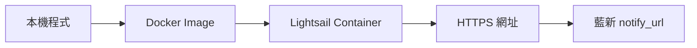
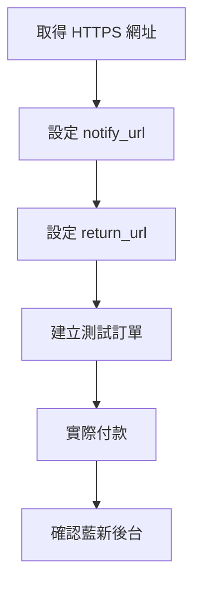

# AWS 部署與環境變數說明

## 路線

## 環境變數

| 名稱 | 用途 |
|---|---|
| `APP_PORT` | 服務 Port，固定 `8080` |
| `DATABASE_DSN` | MySQL 連線字串，需包含 `/payment_service` |
| `NEWEBPAY_MPG_URL` | 藍新 MPG 網址 |
| `NEWEBPAY_MERCHANT_ID` | 商店代號 |
| `NEWEBPAY_HASH_KEY` | HashKey |
| `NEWEBPAY_HASH_IV` | HashIV |
| `NEWEBPAY_NOTIFY_URL` | 藍新通知網址 |
| `NEWEBPAY_RETURN_URL` | 付款完成返回網址 |
| `RY_BASE_URL` | RY 上游站台 Base URL |
| `RY_CUSTOMER_ID` | RY 商戶 ID |
| `RY_SIGN_KEY` | RY MD5 簽名密鑰；目前同時用於收款驗簽與代付上游簽名 |
| `RY_PAYOUT_NOTIFY_URL` | RY 代付回調網址，應指向 `/api/payments/callback` |
| `RY_HTTP_TIMEOUT_SECONDS` | RY API 逾時秒數；逾時不會自動重送 |
| `RY_MAX_SKEW_SECONDS` | 收款 `pay_apply_date` 可接受的最大時間偏差秒數 |

## 藍新網址

| 類型 | 路徑 |
|---|---|
| notify | `/api/v1/deposits/providers/newebpay/notifications` |
| return | `/api/v1/deposits/payment-result` |

## 目前服務

| 項目 | 值 |
|---|---|
| Region | `ap-east-1` |
| Service | `payment-service` |
| URL | `https://payment-service.0f2006wzt5v7m.ap-east-1.cs.amazonlightsail.com` |

## 上線後

