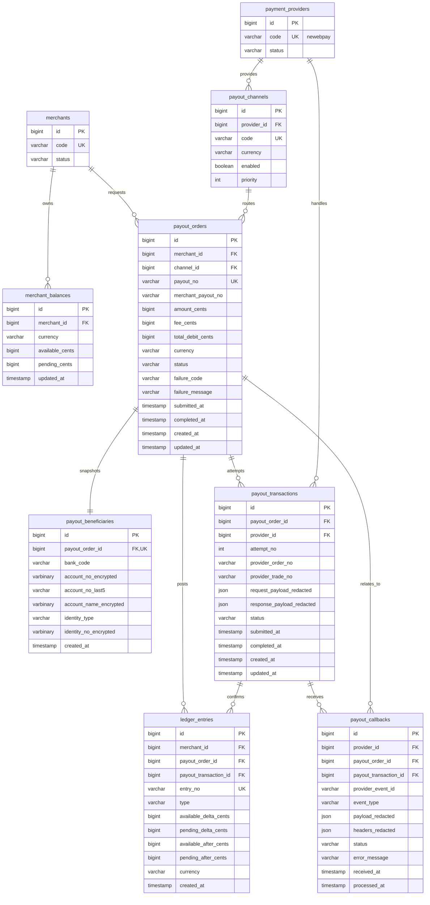
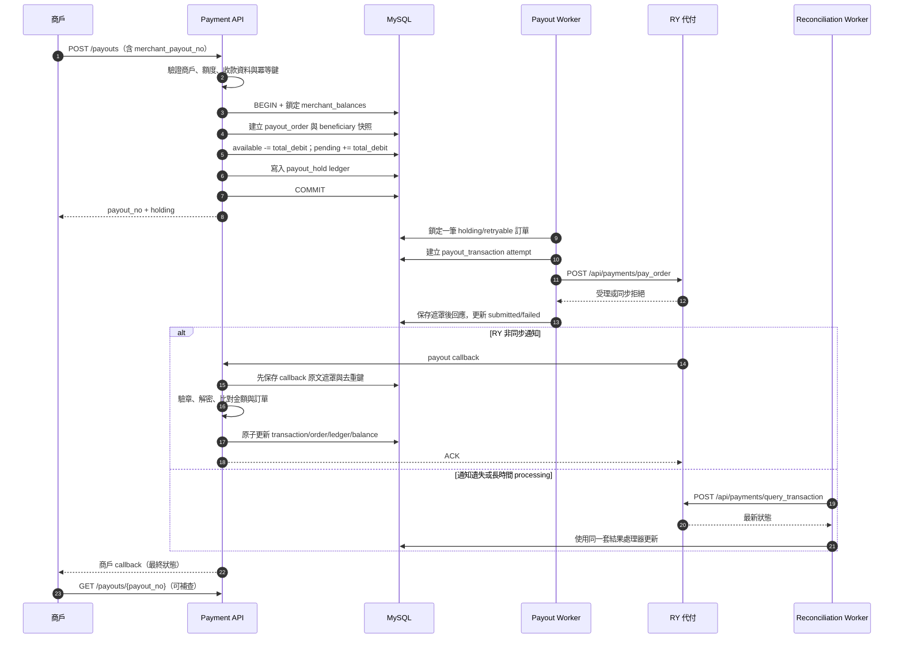
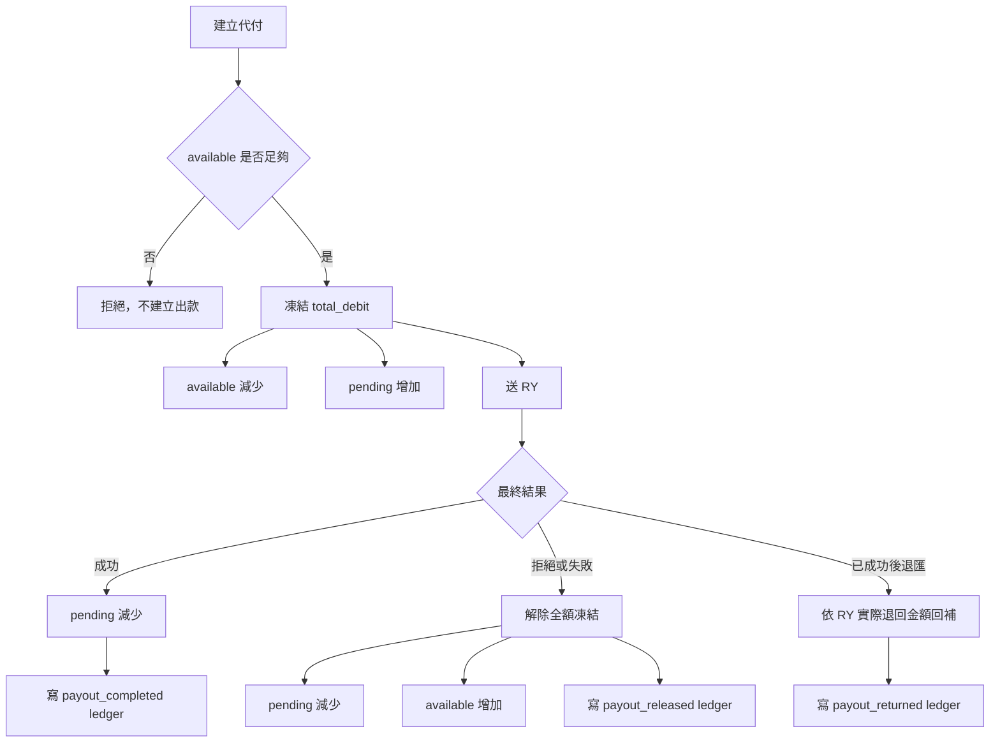
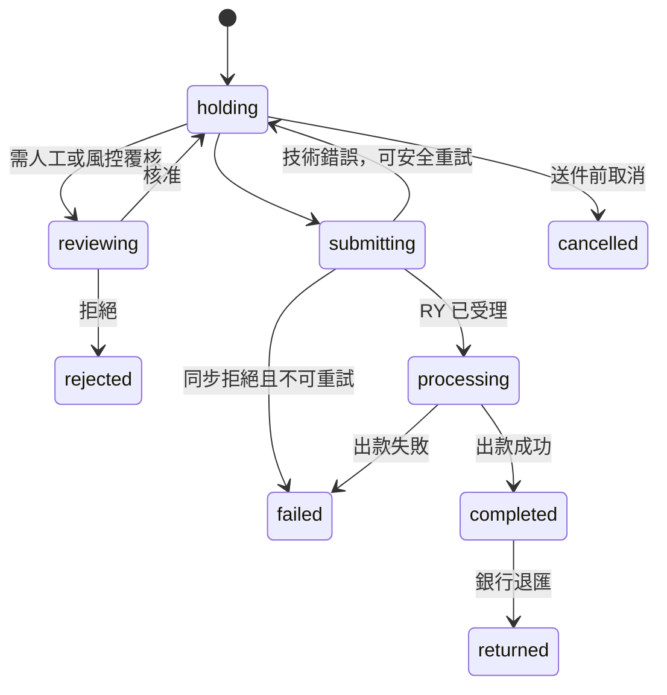

# RY 代付持久化規劃草案

> 範圍只包含代付。商戶、Provider、商戶餘額與總帳沿用既有資料；代收 `orders` 與 `provider_transactions` 不納入本圖。
>
> **本文件是未實作草案。** `migrations/001_init.sql` 目前沒有本文的 `payout_*` 資料表；現行程式只完成 RY HTTP client、代理端點與回調驗簽。

## ERD

### 重要唯一鍵

- `payout_orders (merchant_id, merchant_payout_no)`：商戶端冪等，避免 API 重送造成重複出款。
- `payout_transactions (payout_order_id, attempt_no)`：每次送 RY 都是獨立 attempt。
- `payout_transactions (provider_id, provider_order_no)`：Provider 訂單不可重複。
- `payout_callbacks (provider_id, provider_event_id)`：若 RY 沒有事件編號，改用已正規化 payload 的雜湊去重。
- `ledger_entries.entry_no`：每個會計事件只能入帳一次。

`payout_beneficiaries` 是下單當下的不可變快照，不能只指向可編輯的常用收款人資料，否則歷史訂單會被後續修改污染。完整帳號、戶名與身分資料需加密保存，log、request/response 與 callback 僅留遮罩值。

## 代付資料流

## 餘額與總帳資料流

若未來實作本草案，餘額異動、訂單狀態與 `ledger_entries` 必須在同一個資料庫交易內完成，並鎖定該商戶幣別的 `merchant_balances`。代付金額與手續費一開始一起凍結；退匯時手續費是否退回，依 RY 契約的實際結果入帳，不能先假設全退。

## 建議狀態

只有 `completed`、`failed`、`rejected`、`cancelled`、`returned` 是規劃中的業務終態；網路逾時不是失敗，必須先查 RY 狀態，避免重送造成雙重出款。
