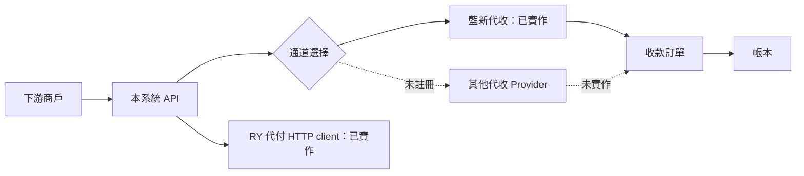
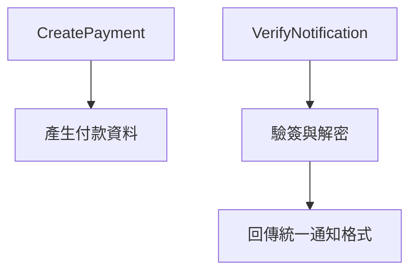
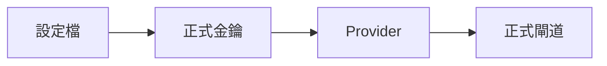

# 支付通道與供應商架構

> 文件定位：描述目前程式的 Provider 邊界；圖中的未註冊供應商不代表已完成串接。

## 架構

## Provider 介面

- 代收使用 `DepositGateway`：目前只註冊 `newebpay`。
- 代付使用獨立的 RY `PayoutClient`：目前不是通用 `PayoutGateway` registry，也沒有本地訂單持久化。

## 正式環境

