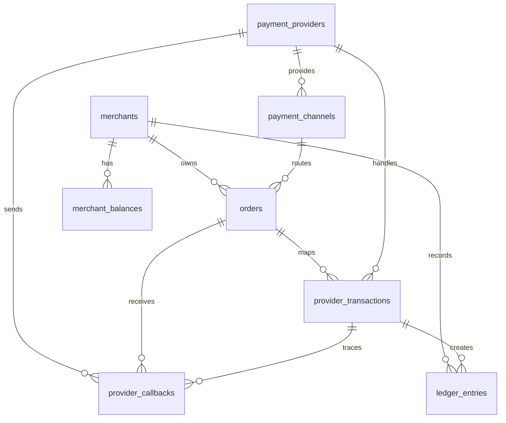
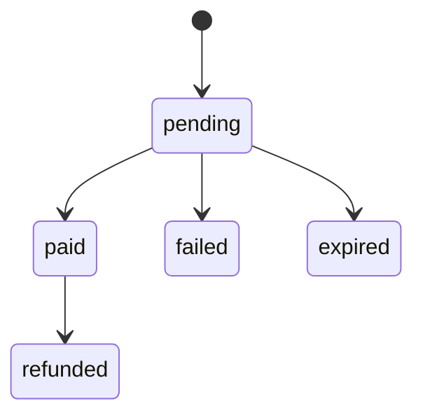
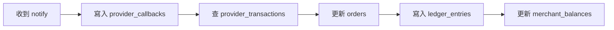
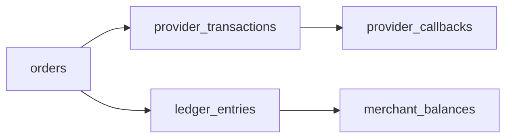

# 核心資料庫結構與帳務流程

> 文件定位：目前 `migrations/001_init.sql` 已建立的**收款**資料結構。現行資料庫沒有 `payout_orders`、`payout_transactions` 或 `payout_callbacks`；代付持久化仍是規劃草案。

## 關聯

## 核心表

| 表 | 用途 |
|---|---|
| `merchants` | 下游商戶 |
| `payment_providers` | 目前實際使用藍新代收；結構可容納其他 Provider |
| `payment_channels` | 信用卡、ATM、超商等通道 |
| `orders` | 本系統代收訂單 |
| `provider_transactions` | 三方交易映射 |
| `provider_callbacks` | 三方通知紀錄 |
| `merchant_balances` | 商戶餘額 |
| `ledger_entries` | 帳本流水 |

RY 代付目前採同步 HTTP 代理，不會寫入上述資料表。

## 訂單狀態

## 通知處理

## 掉單追蹤

