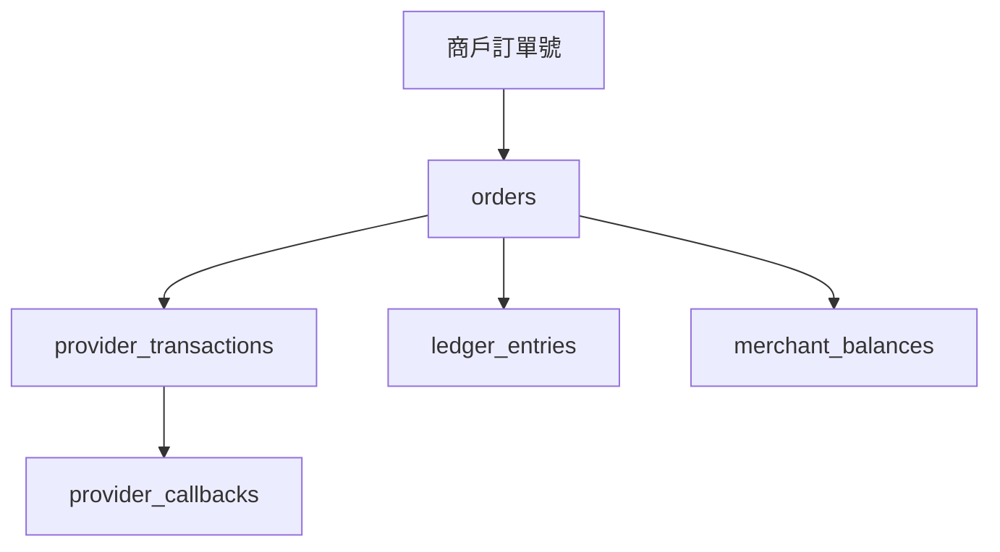
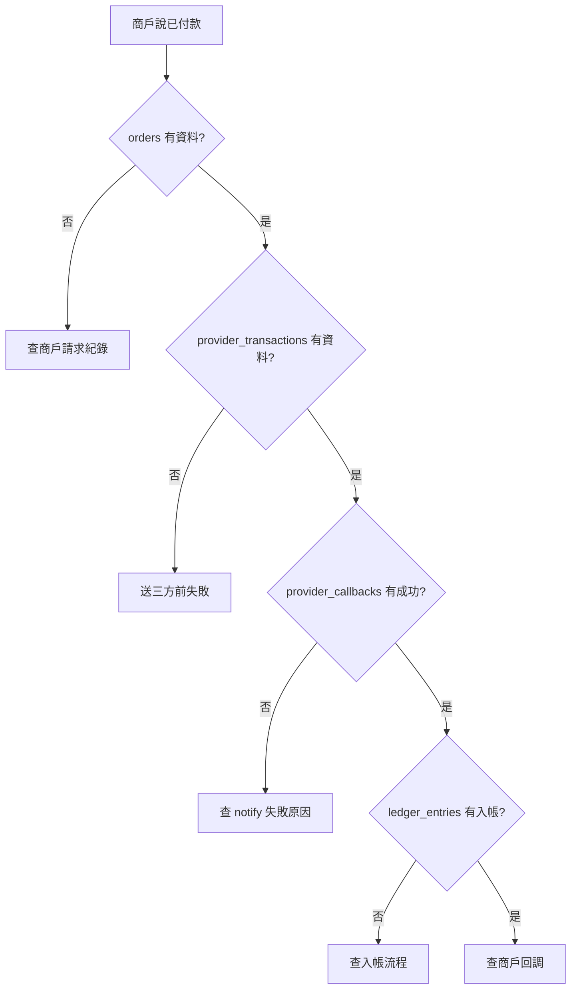
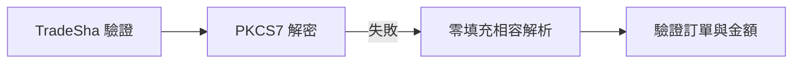
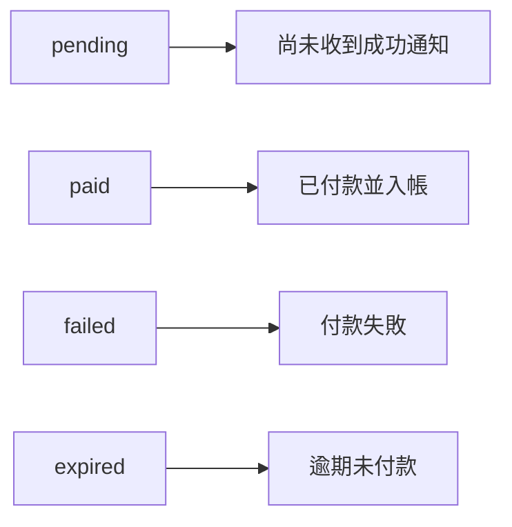
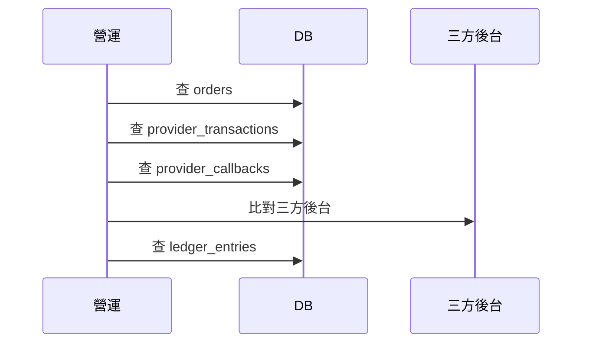

# 系統異常排查指南

## 查詢入口

## 常見掉單

## 查詢欄位

| 情境 | 優先查 |
|---|---|
| 商戶問訂單 | `orders.merchant_order_no` |
| 藍新後台交易 | `provider_transactions.provider_order_no` |
| 藍新交易序號 | `provider_transactions.provider_trade_no` |
| notify 失敗 | `provider_callbacks.error_message` |

### AES padding

實測正式環境：首次通知可能是無 PKCS7 padding 的 AES/CBC，後台補發則可用標準 PKCS7。系統以 PKCS7 為主，僅在 `TradeSha` 正確且明文格式有效時接受零填充或無填充。

驗證失敗仍會寫入 `provider_callbacks`。日誌只記錄密文長度與 SHA256 指紋，用來比較自動 Retry 和後台補發，不記錄通知明文。

建立交易時固定傳送 `EncryptType=0`，不可只依賴藍新預設值。
| 金額不符 | `orders.amount_cents`、`provider_transactions.amount_cents` |
| 未入帳 | `ledger_entries.order_id` |

## 狀態判斷

## 必留資料

| 表 | 必留原因 |
|---|---|
| `orders` | 平台主訂單 |
| `provider_transactions` | 對應三方交易 |
| `provider_callbacks` | 保存原始 notify |
| `ledger_entries` | 對帳與餘額依據 |

## 查單流程

