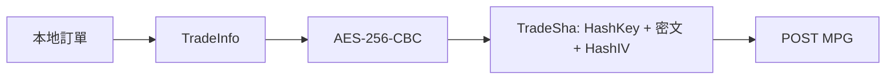
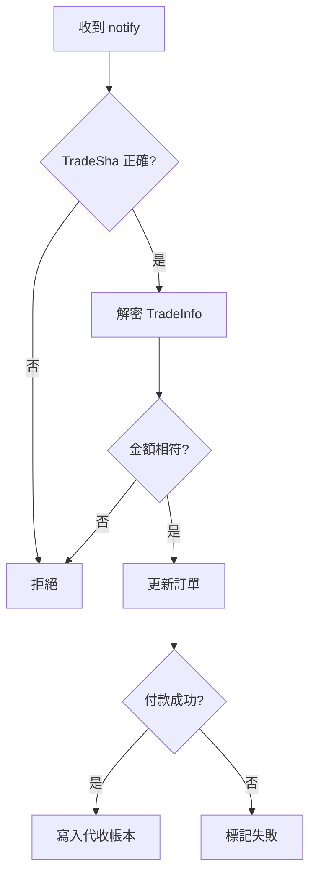

# 藍新代收串接說明

## MPG 送單

## MPG 欄位

| 欄位 | 來源 |
|---|---|
| `MerchantID` | `config.yaml` |
| `TradeInfo` | 加密後交易資料 |
| `TradeSha` | SHA256 驗證碼 |
| `EncryptType` | 固定 `0`，明確指定 AES/CBC/PKCS7 |

> 正式環境實測：首次 Notify 可能沒有 PKCS7 padding。驗簽成功後，接收端須相容有效的無填充 CBC 明文。
| `Version` | `2.3` |

## 通知處理

## 程式位置

| 檔案 | 用途 |
|---|---|
| `client.go` | 藍新 client |
| `crypto.go` | 加解密與驗簽 |
| `mapper.go` | 訂單轉 MPG 欄位 |
| `notify.go` | 通知資料解析 |
