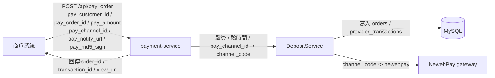
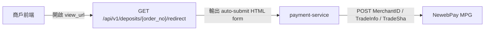
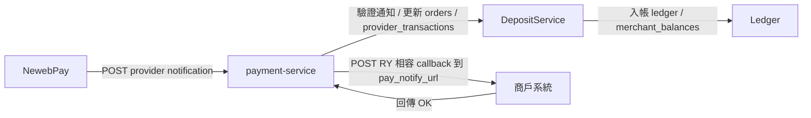
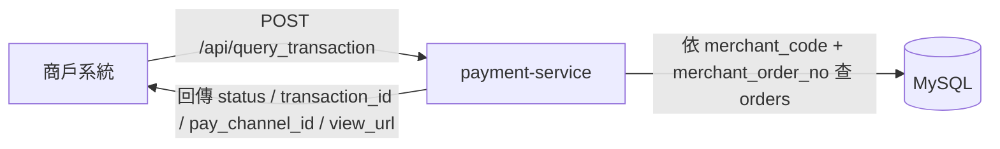

# 代收資料流

> 更新日期：2026-07-09
> 目前代收 provider 僅有 `NewebPay`，收款渠道已縮減為 7 種。

## 1. 建立訂單

### 補充

- `pay_channel_id` 目前只接受 `1000`、`1001`、`1002`、`1005`、`1006`、`1007`、`1008`。
- 內部 `DepositService` 目前只允許 `CREDIT`、`APPLEPAY`、`GOOGLEPAY`、`WEBATM`、`VACC`、`CVS`、`BARCODE`。
- provider mapping 目前全部都指向 `newebpay`。

## 2. 前往付款頁

### 補充

- `view_url` 是 payment-service 的 redirect 頁，不是 provider 原始 URL。
- 前端只需要導向 `view_url`，不需要自己組 NewebPay 表單。

## 3. Provider 通知與商戶 callback

### 補充

- callback 狀態目前只整理成 `30000`、`50000`、`10000` 三種。
- 商戶 callback 內容是 payment-service 統一後的 RY 相容 JSON，不是 NewebPay 原始格式。
- 商戶端必須回 `OK`。

## 4. 查單

### 補充

- 查單回應會把內部 `channel_code` 轉回 `pay_channel_id`。
- `view_url` 會一起回傳，方便商戶重新導流到付款頁。

## 5. 涉及資料表

| 資料表 | 用途 |
|---|---|
| `orders` | 代收訂單主檔 |
| `provider_transactions` | provider request / response / notify 資料 |
| `provider_callbacks` | provider callback 紀錄 |
| `ledger_entries` | 入帳流水 |
| `merchant_balances` | 商戶餘額 |
| `merchants` | 商戶設定與 callback URL |
| `payment_providers` / `payment_channels` | provider 與渠道映射 |

## 6. 實作對照

- `internal/app/server.go`
- `internal/delivery/http/pay_order_handler.go`
- `internal/delivery/http/deposit_handler.go`
- `internal/delivery/http/notify_handler.go`
- `internal/provider/newebpay/client.go`
- `internal/provider/newebpay/notify.go`
- `internal/service/deposit_service.go`
- `internal/repository/deposit_store.go`
